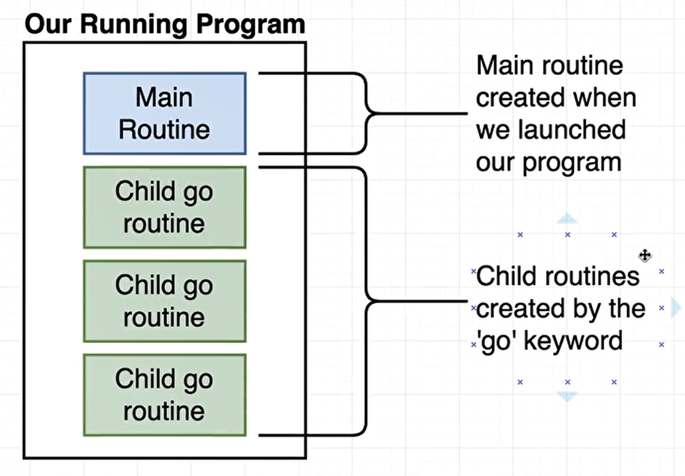
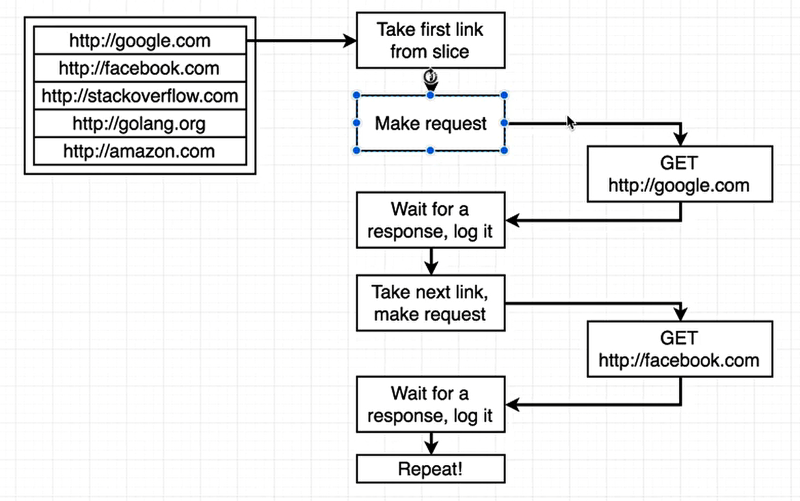
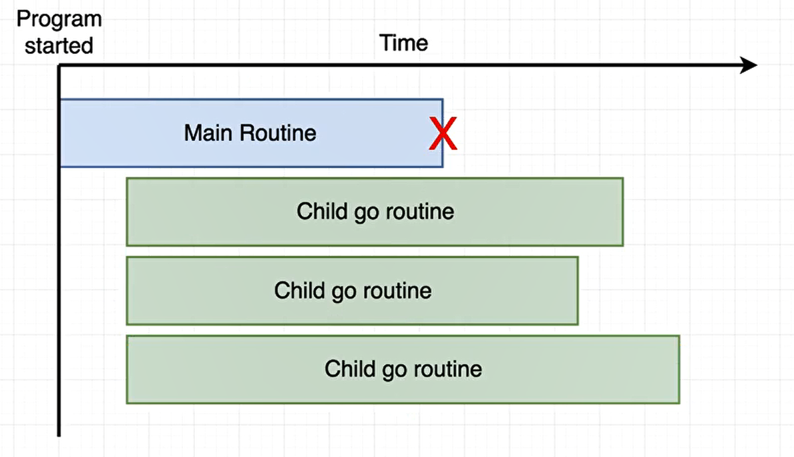
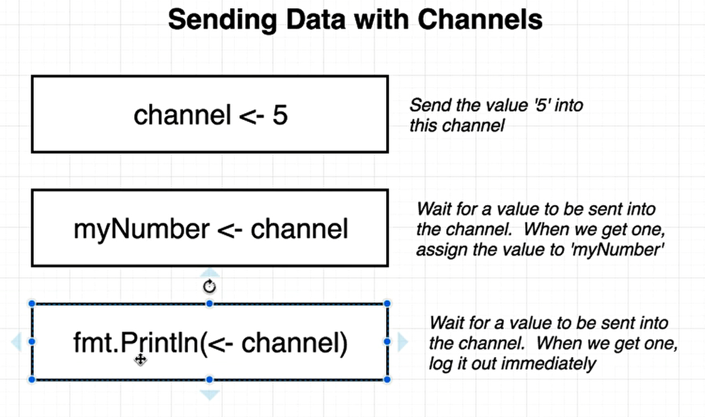

## GO-ROUTINES
---   

### By default Go tries to use one core!

### concurrency
    - we can have multiple threads executing code. If on thread blocks, another one is picked up and worked on.
	- its like a scheduler, we can change the execution of codes on the fly.

### parallelism
	- Multiple threads executed at the exact same time. Requires multiple CPU's

### Channels
    - It's used to communicate between goroutines.
    - It is the only way to communicate between goroutines.
    - Channels are the pipes that connect concurrent goroutines. You can send values into channels from one goroutine and receive those values into another goroutine.
 

1.1
- Examples of go routines

1.2

1.3
- When we do something with GO keyword, it creates a new go routine (child go routine).

1.3
- Sending and Recieving data from channel
